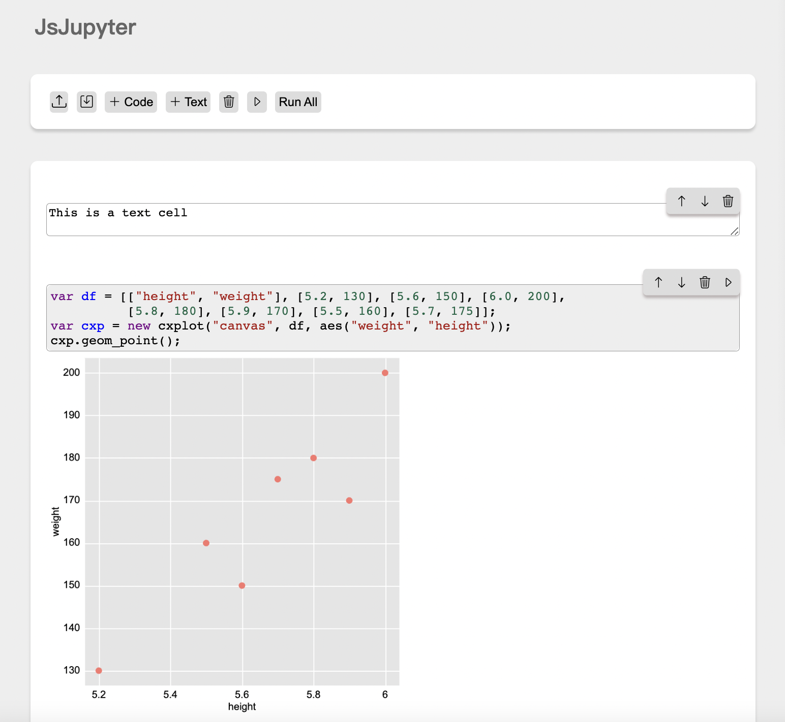
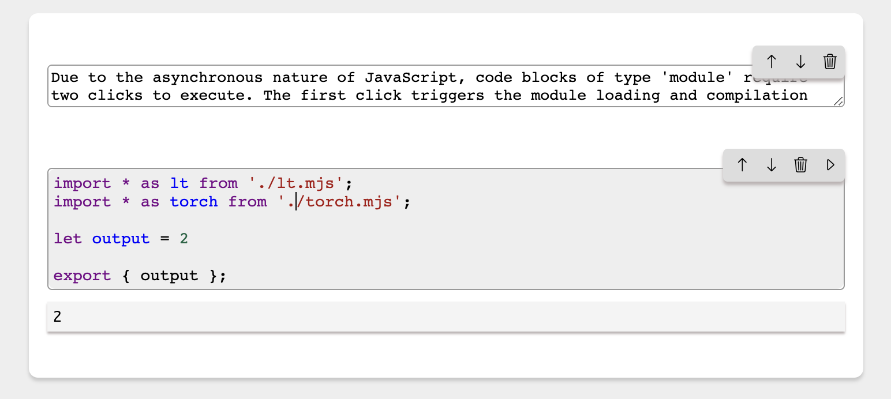

# JsJupyter

## Usage

Alternatively, you can directly access the project's website: [click me](https://01miaom.github.io/JsJupyter/)

## Features

- Interactive notebook interface: Write and execute code in cells.
- Code execution: Run JavaScript code directly in the notebook.
- Plotting capabilities: Create simple plots and charts using the integrated drawing functionality.

- Module scripts: Write and execute modular JavaScript code directly in the notebook.

